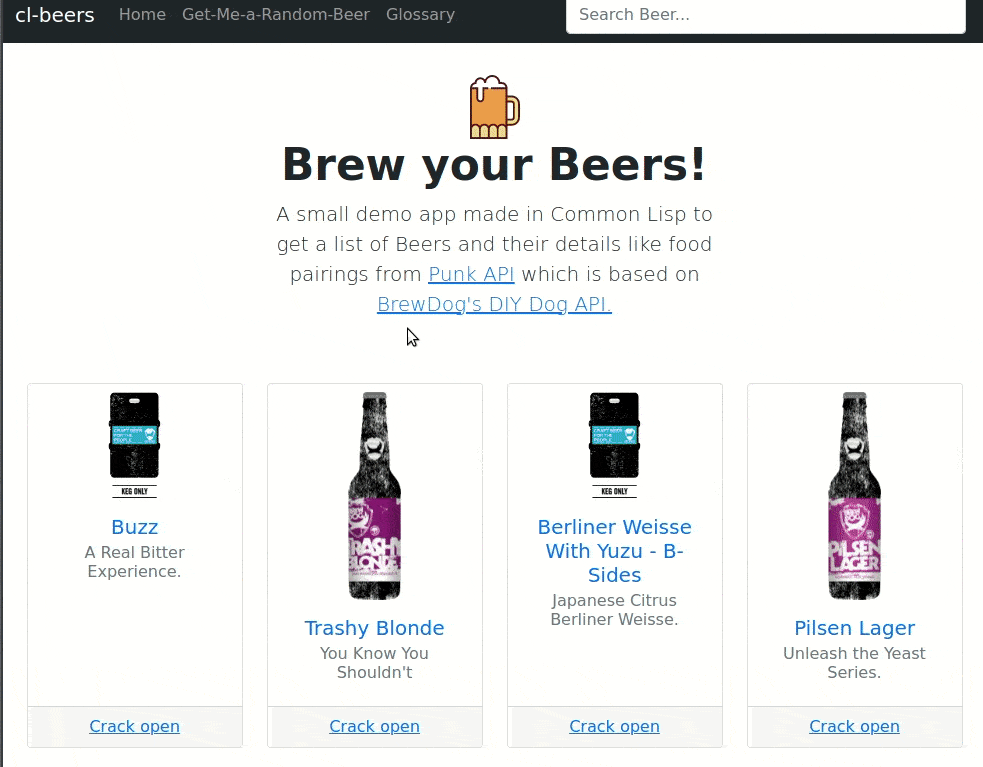

# cl-beers

A small demo app made in Common Lisp to get a list of Beers and their details like 
food pairings from [Punk API](https://punkapi.com) which is based on [BrewDog](https://brewdog.com)'s DIY Dog API.



## Usage

You need [roswell](https://github.com/snmsts/roswell) to install [clack](https://github.com/fukamachi/clack)
```
ros install clack
```

And then using clackup

```
clackup app.lisp
```

Go to `http://localhost:5000` in your browser to see the app in action.

## Install
```
git clone https://github.com/rajasegar/cl-beers
cd cl-beers
clackup app.lisp
```
